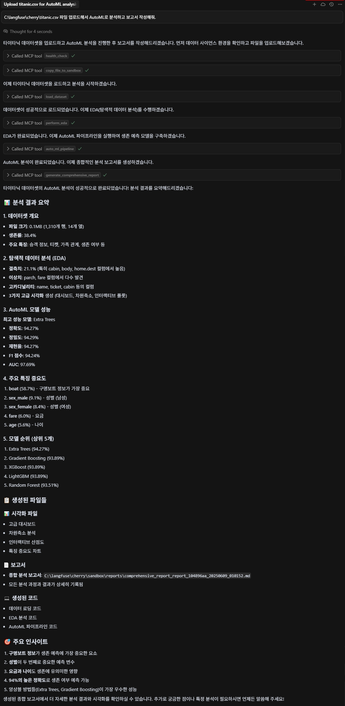

# Advanced Data Science MCP Server

포괄적인 데이터 사이언스 기능과 지능형 분석을 제공하는 고도화된 MCP (Model Context Protocol) 서버입니다. 최신 머신러닝/딥러닝 알고리즘, AutoML, 지능형 문제 유형 감지, 적응적 샘플링, 인터랙티브 시각화를 통해 엔터프라이즈급 데이터 분석을 지원합니다.

## 🚀 주요 기능

### 🧠 **지능형 문제 유형 자동 감지**
- 데이터 특성 기반 자동 문제 유형 판별 (분류/회귀/클러스터링/시계열/이미지/텍스트)
- 지도/비지도 학습 자동 추천
- 타겟 컬럼 자동 추천 및 적합성 평가
- 데이터 크기별 최적 분석 전략 자동 선택

### 🤖 **고급 AutoML & 머신러닝**
- **최신 부스팅 알고리즘**: XGBoost, LightGBM, CatBoost
- **AutoKeras 통합**: 자동 신경망 아키텍처 탐색 (NAS)
- **Gaussian Process**: 불확실성 정량화 기능
- **고급 클러스터링**: HDBSCAN, Spectral Clustering, OPTICS
- **이상치 탐지**: Isolation Forest, One-Class SVM, Elliptic Envelope
- **불균형 데이터 처리**: SMOTE, ADASYN, 언더샘플링

### 📊 **적응적 데이터 처리 및 샘플링**
- **지능형 샘플링**: 100MB 이상 파일에 대한 자동 샘플링
- **샘플링 방법**: 층화표집, 체계표집, 무작위표집
- **품질 검증**: 샘플과 원본 데이터의 통계적 유사성 자동 검증
- **메모리 최적화**: 대용량 데이터의 효율적 처리

### 🎨 **고급 시각화 & 차원 축소**
- **인터랙티브 시각화**: Plotly 기반 동적 차트
- **차원 축소**: t-SNE, UMAP, Isomap, PCA
- **종합 대시보드**: 데이터 품질, 상관관계, 분포 한눈에 보기
- **다양한 플롯**: histogram, scatter, boxplot, heatmap, pairplot, violin, distribution

### 🔬 **모델 해석 & 최적화**
- **SHAP**: 블랙박스 모델 해석 및 특성 중요도
- **실루엣 분석**: 최적 클러스터 수 자동 결정
- **교차 검증**: 다양한 평가 지표로 모델 성능 검증
- **특성 중요도**: 여러 방법론을 통한 특성 분석

### 💻 **완전한 코드 자동 생성**
- 모든 분석 과정의 재현 가능한 Python 코드 자동 생성
- 샘플링 로직, 전처리, 모델링 전체 파이프라인 코드화
- 프로덕션 배포를 위한 독립 실행 가능 스크립트
- API 서빙, 모델 모니터링 코드 템플릿 제공

### 📝 **종합 마크다운 보고서**
- 분석 과정과 결과의 전문적인 마크다운 보고서 자동 생성
- 시각화 임베딩, 코드 설명, 실용적 활용 가이드 포함
- 샘플링 정보, 모델 성능, 권장사항 상세 기술

## 🛠️ 도구 목록

### 📊 핵심 분석 도구
- **`load_dataset`**: 지능형 데이터 로딩 (자동 샘플링, 문제 유형 감지, 타겟 추천)
- **`perform_eda`**: 고급 탐색적 데이터 분석 (대시보드, 차원축소, 이상치 분석)
- **`auto_ml_pipeline`**: 지능형 AutoML 파이프라인 (고급 알고리즘, 자동 평가)
- **`create_visualization`**: 고급 시각화 생성 (다양한 플롯 타입, 인터랙티브)

### 📁 파일 관리 도구
- **`upload_local_file`**: 로컬 파일 업로드 (자동 형식 검증, 안전한 이름 생성)
- **`copy_file_to_sandbox`**: 파일 복사 (커스텀 이름 지정 가능)
- **`list_uploaded_files`**: 업로드된 파일 목록 (데이터 미리보기 포함)
- **`list_available_datasets`**: 사용 가능한 데이터셋 목록 (메타데이터 포함)

### 📋 추적 및 보고서 도구
- **`generate_comprehensive_report`**: 종합 분석 보고서 생성 (마크다운, 시각화 임베딩)
- **`get_operation_details`**: 작업 상세 정보 조회 (입력/출력, 생성 파일)
- **`list_generated_code`**: 생성된 코드 목록 (파일 정보, 코드 타입)
- **`get_upload_instructions`**: 파일 업로드 가이드 (사용법, 예시)

### ⚙️ 시스템 도구
- **`get_environment_info`**: 환경 정보 조회 (패키지 가용성, 지원 기능)
- **`health_check`**: 서버 상태 확인 (시스템 정보, 기능 상태)

## 🔍 지원 알고리즘 상세

### 분류 (Classification)
- **기본**: Random Forest, Gradient Boosting, Extra Trees, Logistic Regression, SVM, k-NN, Naive Bayes, Decision Tree, MLP
- **고급**: XGBoost, LightGBM, CatBoost, Gaussian Process, QDA
- **평가**: Accuracy, Precision, Recall, F1-Score, ROC-AUC

### 회귀 (Regression)
- **기본**: Random Forest, Gradient Boosting, Extra Trees, Linear/Ridge/Lasso/ElasticNet, SVR, k-NN, Decision Tree, MLP
- **고급**: XGBoost, LightGBM, CatBoost, Gaussian Process
- **평가**: R², RMSE, MAE, Cross-validation Score

### 클러스터링 (Clustering)
- **기본**: K-Means, DBSCAN, Agglomerative, Gaussian Mixture
- **고급**: HDBSCAN, Spectral, OPTICS, Mean Shift, Affinity Propagation
- **평가**: Silhouette Score, 자동 최적 클러스터 수 결정

### 이상치 탐지 (Anomaly Detection)
- **알고리즘**: Isolation Forest, One-Class SVM, Elliptic Envelope, Local Outlier Factor
- **평가**: 이상치 비율, 이상치 스코어

## 📈 시각화 타입

| 타입 | 설명 | 필수 파라미터 | 선택 파라미터 |
|------|------|--------------|--------------|
| `histogram` | 히스토그램 | x_column | title |
| `scatter` | 산점도 | x_column, y_column | hue_column, title |
| `boxplot` | 박스플롯 | x_column | y_column, title |
| `heatmap` | 상관관계 히트맵 | - | title |
| `bar` | 바차트 | x_column | y_column, title |
| `pairplot` | 다변량 관계 플롯 | - | hue_column, title |
| `violin` | 바이올린 플롯 | x_column, y_column | title |
| `distribution` | 분포 분석 (히스토그램+KDE+Q-Q) | x_column | title |

## 📂 지원 파일 형식

### 입력 형식
- **CSV**: `.csv` (가장 권장)
- ~~**Excel**: `.xlsx`, `.xls`~~
- ~~**JSON**: `.json`~~
- ~~**Parquet**: `.parquet`~~
- ~~**텍스트**: `.txt`, `.tsv`~~

### 출력 형식
- **데이터**: CSV
- **시각화**: PNG (정적), HTML (인터랙티브)
- **모델**: PKL (joblib)
- **보고서**: JSON, Markdown
- **코드**: Python (.py)

## 🚀 빠른 시작

### Linux/Mac 사용자

```bash
# 1. uv 설치 (없는 경우)
curl -LsSf https://astral.sh/uv/install.sh | sh
source ~/.bashrc  # 또는 ~/.zshrc

# 2. 프로젝트 설정
git clone https://github.com/chokukil/mcp-data-science.git
cd mcp-data-science

# 3. 기본 의존성 설치
uv venv --python 3.10
source .venv/bin/activate
uv pip install -e .

# 4. 고급 기능 설치 (선택적)
uv pip install -e ".[all]"  # 모든 고급 기능 한번에 설치

# 5. 서버 실행
python mcp_data_science.py --sandbox-dir ./sandbox --port 8007
```

### Windows 사용자

```powershell
# 1. uv 설치 (없는 경우) - PowerShell을 관리자 권한으로 실행
powershell -ExecutionPolicy ByPass -c "irm https://astral.sh/uv/install.ps1 | iex"
# PowerShell 재시작

# 2. 프로젝트 설정
git clone https://github.com/chokukil/mcp-data-science.git
cd mcp-data-science

# 3. 기본 의존성 설치
uv venv --python 3.10
.\.venv\Scripts\activate
uv pip install -e .

# 4. 고급 기능 설치 (선택적)
uv pip install -e ".[all]"  # 모든 고급 기능 한번에 설치
```

### 3. 서버 실행

```bash
# 기본 실행
python mcp_data_science.py

# uv를 사용한 격리 실행
uv run --isolated mcp_data_science.py

# 커스텀 설정
uv run --isolated --sandbox-dir ./my_sandbox --port 8008

# 모든 고급 기능과 함께 실행 (시간이 수 분 걸릴 수 있습니다.)
uv run --isolated --extra all mcp_data_science.py
```

### 4. 기본 사용법
# 1. 파일 업로드
upload_result = await upload_local_file('/path/to/your/data.csv')

# 2. 데이터 로드 (자동 샘플링, 문제 유형 감지)
load_result = await load_dataset(upload_result['file_info']['destination_path'])
dataset_id = load_result['dataset_id']

# 3. 탐색적 데이터 분석
eda_result = await perform_eda(dataset_id)

# 4. AutoML 실행
automl_result = await auto_ml_pipeline(
    dataset_id=dataset_id,
    target_column='target',  # 또는 None으로 자동 감지
    include_advanced=True
)

# 5. 시각화 생성
viz_result = await create_visualization(
    dataset_id=dataset_id,
    plot_type='pairplot',
    hue_column='category'
)

# 6. 종합 보고서 생성
report_result = await generate_comprehensive_report()
```

## 💡 고급 사용 시나리오

### 🎯 대용량 데이터 처리

```python
# 500MB CSV 파일 처리
await upload_local_file('/data/large_dataset.csv')
# → 자동으로 지능형 샘플링 적용 (층화표집/체계표집/무작위표집)

load_result = await load_dataset('large_dataset_20241207_143052.csv')
# 출력 예시:
# - 원본: 1,000,000 행
# - 샘플: 30,000 행 (층화표집)
# - 품질: Excellent (분포 차이 < 2%)
```

### 🔬 문제 유형 자동 감지

```python
# 타겟 컬럼 없이 로드 → 자동 추천
load_result = await load_dataset('mystery_data.csv')
# 출력:
# - 감지된 문제 유형: classification
# - 추천 타겟: 'survived' (분류, 적합도 85점)
# - 대안 타겟: 'age' (회귀, 적합도 70점)

# 추천 타겟으로 AutoML 실행
await auto_ml_pipeline('dataset_123', target_column='survived')
```

### 🧪 고급 알고리즘 활용

```python
# 고급 알고리즘 포함 AutoML
automl_result = await auto_ml_pipeline(
    dataset_id='dataset_123',
    target_column='target',
    include_advanced=True  # XGBoost, LightGBM, CatBoost, Gaussian Process
)

# 결과 예시:
# 1위: CatBoost (정확도: 94.2%)
# 2위: XGBoost (정확도: 93.8%)
# 3위: LightGBM (정확도: 93.5%)
```

### 📊 클러스터링 자동 최적화

```python
# 비지도 학습 - 자동 클러스터 수 결정
await auto_ml_pipeline(
    dataset_id='dataset_no_target',
    target_column=None
)
# → 실루엣 분석으로 최적 k=5 자동 결정
# → HDBSCAN, Spectral Clustering 등 고급 알고리즘 비교
```

## 📈 적응적 샘플링 전략

| 파일 크기 | 샘플링 방법 | 목표 샘플 크기 | 메모리 절약 |
|-----------|------------|--------------|------------|
| < 100MB | 샘플링 안함 | 전체 데이터 | 0% |
| 100-500MB | 층화/무작위 | 50,000 행 | ~70% |
| 500MB-1GB | 층화/체계 | 30,000 행 | ~80% |
| 1-2GB | 체계 표집 | 20,000 행 | ~85% |
| > 2GB | 체계 표집 | 15,000 행 | ~90% |

### 샘플링 품질 보장
- **통계적 유사성**: 평균값 차이 < 5%
- **분포 보존**: 타겟 변수 분포 차이 < 2%
- **품질 등급**: Excellent / Good / Fair 자동 평가
- **전체 검증**: 생산 배포 전 전체 데이터 검증 권장

## 🏗️ 프로젝트 구조

```
mcp-data-science/
├── mcp_data_science.py          # 메인 서버 코드 (단일 파일)
├── pyproject.toml               # 프로젝트 설정 및 의존성
├── README.md                    # 이 문서
├── .env                         # 환경 변수 (선택적)
│   └── OPENAI_API_KEY=...      # LLM 향상 기능용
└── sandbox/                     # 작업 디렉토리 (자동 생성)
    ├── datasets/                # 업로드/로드된 데이터셋
    ├── plots/                   # 생성된 시각화 (PNG, HTML)
    ├── models/                  # 학습된 모델 (PKL)
    ├── reports/                 # 분석 보고서 (JSON, MD)
    ├── logs/                    # 작업 로그 (JSON)
    └── generated_code/          # 생성된 Python 코드
```

## 🔧 환경 설정

### 환경 변수 (.env 파일)

```bash
# OpenAI API 키 (선택적 - 보고서 향상용)
OPENAI_API_KEY=sk-...

# 서버 설정 (기본값 사용 가능)
# MCP_SERVER_PORT=8007
# MCP_SANDBOX_DIR=./sandbox
```

### 패키지 그룹별 설치

```bash
# 기본 설치 (필수 패키지만)
uv pip install -e .

# 기능별 설치
uv pip install -e ".[ml]"        # 머신러닝 부스팅 (XGBoost, LightGBM, CatBoost)
uv pip install -e ".[dl]"        # 딥러닝 (TensorFlow, AutoKeras, Keras-Tuner)
uv pip install -e ".[viz]"       # 고급 시각화 (Plotly)
uv pip install -e ".[interpret]" # 모델 해석 (SHAP)
uv pip install -e ".[advanced]"  # 고급 분석 (UMAP, HDBSCAN, Optuna)
uv pip install -e ".[stats]"     # 통계 분석 (statsmodels)
uv pip install -e ".[image]"     # 이미지 처리 (Pillow)
uv pip install -e ".[llm]"       # LLM 통합 (OpenAI)

# 조합 설치
uv pip install -e ".[ml,viz,interpret]"  # 자주 사용하는 조합
uv pip install -e ".[all]"               # 모든 기능
```

## 🛡️ 보안 및 성능

### 🔒 데이터 보안
- **로컬 처리**: 모든 데이터는 로컬에서만 처리
- **샘플링 정보**: LLM에는 통계 요약만 전송, 원본 데이터 비전송
- **파일 격리**: 샌드박스 디렉토리로 안전한 파일 관리
- **로그 추적**: 모든 작업의 상세한 로그 기록

### ⚡ 성능 최적화
- **적응적 샘플링**: 대용량 데이터의 지능적 크기 조정
- **메모리 효율**: 청크 단위 처리로 메모리 사용량 최소화
- **조기 종료**: 성능이 수렴하면 자동으로 학습 중단
- **캐싱**: 중간 결과 캐싱으로 반복 작업 최적화

### 📊 성능 벤치마크

| 데이터 크기 | 행 수 | 처리 시간 | 메모리 사용 | 샘플링 적용 |
|-----------|------|---------|-----------|-----------|
| 소형 | < 10K | < 30초 | < 500MB | ❌ |
| 중형 | 10K-100K | 1-5분 | 500MB-2GB | ❌ |
| 대형 | 100K-1M | 2-15분 | 1-4GB | ✅ |
| 초대형 | > 1M | 5-30분 | 2-8GB | ✅ |

## 🚨 트러블슈팅

### 일반적인 문제들

#### 1. 메모리 부족 오류
```python
# 해결: 더 작은 샘플 크기 사용
# 100MB 임계값을 50MB로 낮춤
import os
os.environ['DATA_SIZE_THRESHOLD_MB'] = '50'
```

#### 2. TensorFlow/AutoKeras 설치 문제
```bash
# Apple Silicon Mac
pip install tensorflow-macos tensorflow-metal

# CUDA GPU 지원
pip install tensorflow[and-cuda]

# 또는 CPU 버전만
pip install tensorflow-cpu
```

#### 3. 패키지 버전 충돌
```bash
# 가상환경 재생성
python -m venv venv --clear
source venv/bin/activate  # 또는 Windows: venv\Scripts\activate
pip install --upgrade pip
# 패키지 재설치...
```

#### 4. 파일 업로드 실패
```python
# 해결: 파일 경로 확인 및 권한 체크
import os
print(f"파일 존재: {os.path.exists('/path/to/file.csv')}")
print(f"읽기 권한: {os.access('/path/to/file.csv', os.R_OK)}")
```

#### 5. 서버 시작 실패
```bash
# 포트 충돌 확인
netstat -tlnp | grep 8007

# 다른 포트 사용
python mcp_data_science.py --port 8008
```

### 로그 확인

```python
# 작업 로그 확인
tail -f sandbox/logs/operation_*.json

# 서버 로그 확인 (콘솔 출력)
```

## ⚙️ MCP 서버 설정

MCP 서버를 사용하려면 설정 파일을 구성해야 합니다.

사용하고자 하는 환경의 MCP 설정 파일을 열어 아래 내용을 추가하여 사용할 수 있습니다.

#### 설정 파일 내용

```json
{
  "mcpServers": {
    "data-science": {
      "transport": "sse",
      "url": "http://localhost:8007/sse"
    }
  }
}
```

### 포트 설정

기본 포트 8007이 사용 중인 경우 다른 포트를 사용할 수 있습니다:

```bash
# 포트 사용 확인 (Linux/Mac)
lsof -i :8007

# 포트 사용 확인 (Windows)
netstat -an | findstr :8007

# 다른 포트로 서버 실행
python mcp_data_science.py --port 8008
```

설정 파일에서도 해당 포트로 변경:
```json
{
  "mcpServers": {
    "data-science": {
      "transport": "sse",
      "url": "http://localhost:8008/sse"
    }
  }
}
```

## 🎯 MCP 호출 예제

다음은 Claude Desktop에서 데이터 사이언스 MCP 서버를 사용하는 실제 예제입니다.



### 🔥 **[📑 종합 분석 보고서 보기](samples/titanic/reports/comprehensive_report_report_104896aa_20250609_010152.md)** 🔥


### 📊 기본 데이터 분석 워크플로우

```plaintext
사용자: "CSV 파일을 업로드하고 데이터 분석을 해주세요."

Claude: upload_local_file() → load_dataset() → perform_eda() → auto_ml_pipeline()
```

### 🔍 단계별 MCP 도구 호출

#### 1. 환경 확인
```plaintext
사용자: "데이터 사이언스 서버가 정상 작동하는지 확인해주세요."

Claude가 호출: health_check()
```

#### 2. 파일 업로드
```plaintext
사용자: "로컬에 있는 sales_data.csv 파일을 분석해주세요."

Claude가 호출:
1. upload_local_file('/path/to/sales_data.csv')
2. load_dataset('sales_data_20241207_143052.csv')
```

#### 3. 탐색적 데이터 분석
```plaintext
사용자: "데이터의 기본 특성과 분포를 확인해주세요."

Claude가 호출:
1. perform_eda(dataset_id='dataset_123')
2. create_visualization(dataset_id='dataset_123', plot_type='pairplot')
```

#### 4. 머신러닝 모델링
```plaintext
사용자: "매출 예측 모델을 만들어주세요."

Claude가 호출:
1. auto_ml_pipeline(
     dataset_id='dataset_123',
     target_column='sales',
     include_advanced=True
   )
```

#### 5. 결과 보고서 생성
```plaintext
사용자: "전체 분석 결과를 정리한 보고서를 만들어주세요."

Claude가 호출:
1. generate_comprehensive_report()
2. list_generated_code()
```

### 💡 고급 사용 시나리오

#### 대용량 데이터 처리
```plaintext
사용자: "500MB 고객 데이터를 분석해주세요. 메모리 효율적으로 처리해주세요."

Claude의 자동 처리:
1. upload_local_file() → 자동 샘플링 감지
2. load_dataset() → 층화표집으로 30,000행 샘플 생성
3. perform_eda() → 샘플 데이터로 EDA 수행
4. auto_ml_pipeline() → 고급 알고리즘으로 모델링
```

#### 문제 유형 자동 감지
```plaintext
사용자: "이 데이터셋으로 무엇을 분석할 수 있는지 알려주세요."

Claude가 호출:
1. load_dataset() → 자동 문제 유형 감지
2. 결과: "분류 문제로 감지, 추천 타겟: 'customer_churn'"
```

#### 커스텀 시각화
```plaintext
사용자: "연령대별 구매 패턴을 시각화해주세요."

Claude가 호출:
create_visualization(
  dataset_id='dataset_123',
  plot_type='boxplot',
  x_column='age_group',
  y_column='purchase_amount',
  title='연령대별 구매 패턴'
)
```

### 🚀 실제 사용 팁

1. **효율적인 워크플로우**
   - 먼저 `health_check`로 서버 상태 확인
   - `upload_local_file` → `load_dataset` → `perform_eda` 순서로 진행
   - 큰 데이터는 자동 샘플링 결과를 먼저 확인

2. **오류 처리**
   - 파일 업로드 실패 시 `get_upload_instructions` 확인
   - 메모리 부족 시 더 작은 샘플 크기 요청
   - 모델링 실패 시 `get_operation_details`로 상세 정보 확인

3. **결과 활용**
   - `list_generated_code`로 재현 가능한 Python 코드 확인
   - `generate_comprehensive_report`로 전문적인 분석 보고서 생성
   - 생성된 모델은 `sandbox/models/`에서 확인 가능

## 📝 라이센스

MIT License - 자유롭게 사용, 수정, 배포 가능

---

## 🔄 버전 히스토리

### v0.3.0 (현재)
- 🎯 지능형 문제 유형 자동 감지
- 🧠 고급 ML 알고리즘 (XGBoost, LightGBM, CatBoost, Gaussian Process)
- 📊 적응적 샘플링 (층화/체계/무작위)
- 🎨 고급 시각화 (Plotly, 차원축소, 대시보드)
- 🔬 SHAP 기반 모델 해석
- 💻 완전한 코드 자동 생성
- 📝 종합 마크다운 보고서
- 📁 파일 업로드 및 관리
- ⚡ 성능 최적화 및 안정성

### 주요 개선사항
- **지능형 분석**: 데이터 특성 기반 자동 문제 유형 감지
- **품질 보장**: 샘플링 품질 자동 검증 시스템
- **사용자 친화**: 직관적인 API와 상세한 가이드
- **엔터프라이즈**: 대용량 데이터 안정적 처리
- **재현성**: 모든 분석의 완전한 코드 생성

---

**💡 팁**: 최상의 결과를 위해 타겟 컬럼이 있는 지도학습 문제를 권장하며, 대용량 데이터의 경우 자동 샘플링 결과를 검토한 후 필요시 전체 데이터로 재검증하세요.