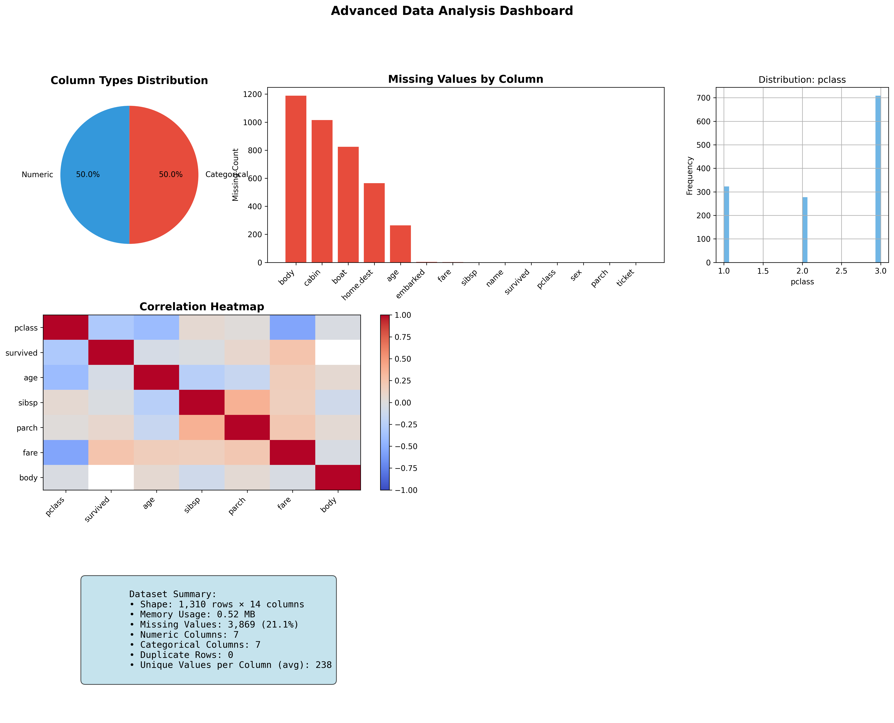
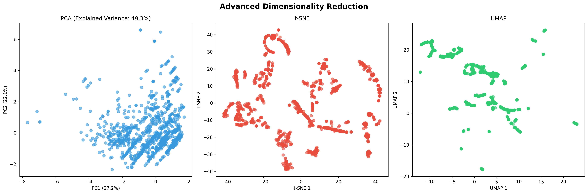
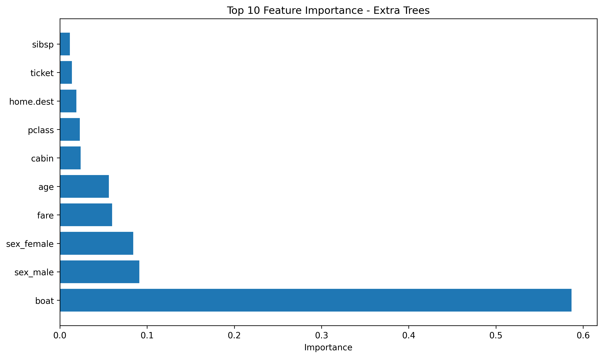

# 타이타닉 생존 예측 AutoML 분석 보고서

**데이터셋**: Titanic Dataset  
**분석 일시**: 2025년 06월 09일 01시 01분  
**보고서 ID**: `report_104896aa`

---

## 📋 Executive Summary

본 분석에서는 **Titanic Dataset** 데이터셋에 대한 포괄적인 탐색적 데이터 분석 및 머신러닝 모델링을 수행했습니다. 
최종적으로 **Extra Trees** 모델이 최고 성능을 보였으며, 테스트 정확도 **94.3%**, F1 점수 **0.942**를 달성했습니다.

---

## 목차

1. [데이터셋 개요](#1-데이터셋-개요)
2. [탐색적 데이터 분석 (EDA)](#2-탐색적-데이터-분석-eda)
3. [머신러닝 모델링](#3-머신러닝-모델링)
4. [시각화 결과](#4-시각화-결과)
5. [생성된 코드](#5-생성된-코드)
6. [산출물 활용 가이드](#6-산출물-활용-가이드)
7. [결론 및 권장사항](#7-결론-및-권장사항)

---

## 1. 데이터셋 개요

### 1.1 데이터 기본 정보

- **원본 파일**: `C:\langfuse\cherry\sandbox\datasets\titanic.csv`
- **파일 크기**: 0.10 MB
- **데이터 규모**: 1,310 행 × 14 열
- **메모리 사용량**: 0.52 MB

### 1.2 변수 구성

**수치형 변수 (7개)**: `pclass, survived, age, sibsp, parch, fare, body`

**범주형 변수 (7개)**: `name, sex, ticket, cabin, embarked, boat, home.dest`

### 1.3 데이터 품질

- **전체 결측값**: 3,869개 (21.1%)
- **주요 결측 변수**:

  - `body`: 1,189개 (90.8%)
  - `cabin`: 1,015개 (77.5%)
  - `boat`: 824개 (62.9%)
  - `home.dest`: 565개 (43.1%)
  - `age`: 264개 (20.2%)

### 1.4 데이터 파일

| 파일명 | 크기 (MB) | 설명 |
|--------|-----------|------|
| `dataset_titanic_load.csv` | 0.11 | 처리된 데이터 |
| `titanic.csv` | 0.10 | 원본 데이터 |

## 2. 탐색적 데이터 분석 (EDA)

### 2.1 기술통계 요약

#### 수치형 변수 통계

| 변수 | 평균 | 표준편차 | 최솟값 | 중앙값 | 최댓값 | 결측값 |
|------|------|----------|--------|--------|--------|--------|
| `pclass` | 2.28 | 0.84 | 1.00 | 3.00 | 3.00 | 1 |
| `survived` | 0.38 | 0.49 | 0.00 | 0.00 | 1.00 | 1 |
| `age` | 29.89 | 14.30 | 0.17 | 28.00 | 76.00 | 264 |
| `sibsp` | 0.50 | 1.04 | 0.00 | 0.00 | 8.00 | 1 |
| `parch` | 0.38 | 0.87 | 0.00 | 0.00 | 9.00 | 1 |
| `fare` | 33.89 | 51.73 | 0.00 | 14.50 | 512.33 | 2 |
| `body` | 156.56 | 95.72 | 7.00 | 147.00 | 328.00 | 1,189 |

### 2.3 주요 발견사항

- ✅ Analysis performed on complete dataset
- ⚠️ High missing data ratio: 21.1% - advanced imputation needed
- 📊 High outlier columns: parch, fare - consider robust methods
- 🏷️ High cardinality columns: name, ticket, cabin - need advanced encoding

## 3. 머신러닝 모델링

### 3.1 문제 정의 및 접근법

- **문제 유형**: Classification
- **타겟 변수**: `survived`

### 3.2 데이터 전처리

**적용된 전처리 기법**:

**결측값 처리**:

- pclass: filled with median
- survived: filled with median
- name: filled with mode
- sex: filled with mode
- age: filled with median
- ... 및 9개 추가 변수

**범주형 변수 인코딩**:

- name: frequency encoding
- sex: one-hot encoding
- ticket: frequency encoding
- cabin: frequency encoding
- embarked: one-hot encoding
- boat: frequency encoding
- home.dest: frequency encoding

### 3.3 모델 성능 비교

| 모델 | 교차검증 점수 | 테스트 정확도 | Precision | Recall | F1 Score |
|------|---------------|---------------|-----------|--------|----------|
| Random Forest | 0.9437 | 0.9351 | 0.9362 | 0.9351 | 0.9345 |
| Gradient Boosting | 0.9446 | 0.9389 | 0.9416 | 0.9389 | 0.9381 |
| Extra Trees | 0.9360 | 0.9427 | 0.9429 | 0.9427 | 0.9424 |
| Logistic Regression | 0.9503 | 0.9237 | 0.9258 | 0.9237 | 0.9226 |
| SVM | 0.9484 | 0.9275 | 0.9303 | 0.9275 | 0.9264 |
| K-Nearest Neighbors | 0.9275 | 0.9084 | 0.9082 | 0.9084 | 0.9078 |
| Naive Bayes | 0.4885 | 0.4962 | 0.7633 | 0.4962 | 0.4266 |
| Decision Tree | 0.9189 | 0.9160 | 0.9158 | 0.9160 | 0.9159 |
| MLP | 0.9322 | 0.9198 | 0.9206 | 0.9198 | 0.9190 |
| Gaussian Process | 0.9332 | 0.9237 | 0.9237 | 0.9237 | 0.9232 |
| QDA | 0.5763 | 0.5344 | 0.7178 | 0.5344 | 0.4973 |
| XGBoost | 0.9408 | 0.9389 | 0.9398 | 0.9389 | 0.9384 |
| LightGBM | 0.9408 | 0.9389 | 0.9405 | 0.9389 | 0.9382 |
| CatBoost | 0.9465 | 0.9313 | 0.9337 | 0.9313 | 0.9303 |

### 3.4 최적 모델: Extra Trees

**Extra Trees** 모델이 최고 성능을 보였으며, 주요 성능 지표는 다음과 같습니다:

- **테스트 정확도**: 94.3%
- **F1 Score**: 0.9424
- **교차검증 점수**: 0.9360 ± 0.0207

### 3.5 특성 중요도 분석

**상위 10개 중요 특성**:

| 순위 | 특성 | 중요도 | 기여도 |
|------|------|--------|--------|
| 1 | `boat` | 0.5867 | 58.7% |
| 2 | `sex_male` | 0.0911 | 9.1% |
| 3 | `sex_female` | 0.0840 | 8.4% |
| 4 | `fare` | 0.0598 | 6.0% |
| 5 | `age` | 0.0561 | 5.6% |
| 6 | `cabin` | 0.0239 | 2.4% |
| 7 | `pclass` | 0.0228 | 2.3% |
| 8 | `home.dest` | 0.0188 | 1.9% |
| 9 | `ticket` | 0.0138 | 1.4% |
| 10 | `sibsp` | 0.0114 | 1.1% |

## 4. 시각화 결과

### 4.1 데이터 분석 대시보드



포괄적인 데이터 분석 대시보드로 데이터의 전반적인 특성, 결측값 패턴, 상관관계 등을 한눈에 볼 수 있습니다.

### 4.2 차원 축소 분석



PCA, t-SNE, UMAP 등의 고급 차원 축소 기법을 사용하여 고차원 데이터를 2차원으로 시각화했습니다. 데이터의 구조와 패턴을 파악할 수 있습니다.

### 4.3 특성 중요도 시각화



머신러닝 모델에서 각 특성의 중요도를 시각화한 차트입니다. 상위 특성들이 예측에 가장 큰 영향을 미칩니다.

총 3개의 시각화가 생성되었습니다. 각 차트는 데이터의 다양한 측면을 보여주며, 종합적인 이해를 돕습니다.

## 5. 생성된 코드

### 5.1 데이터 로딩 및 샘플링 전략을 포함한 데이터 준비 코드입니다.

**파일명**: `titanic_load_data_loading.py`  
**사용된 라이브러리**: `pandas, numpy`

**핵심 기능**:

- 대용량 파일 지능형 샘플링
- 데이터 품질 검증
- 메모리 효율적 로딩

### 5.2 탐색적 데이터 분석 코드로 데이터의 기본 통계, 상관관계, 분포, 결측값 패턴을 분석합니다.

**파일명**: `titanic_eda_eda.py`  
**사용된 라이브러리**: `pandas, seaborn, matplotlib, warnings, numpy`

**핵심 기능**:

- 기술통계 계산 (df.describe())
- 상관관계 히트맵 시각화
- 변수 분포 히스토그램
- 결측값 패턴 분석 및 시각화

**주요 구현 내용**:

- `import matplotlib.pyplot as plt`
- `print(df.describe())`
- `correlation_matrix = df[numeric_cols].corr()`
- `sns.heatmap(correlation_matrix, annot=True, cmap='coolwarm', center=0)`
- `plt.savefig('correlation_heatmap.png', dpi=300, bbox_inches='tight')`
- `df[numeric_cols].hist(bins=30, alpha=0.7)`
- `plt.savefig('distributions.png', dpi=300, bbox_inches='tight')`
- `missing_values[missing_values > 0].plot(kind='bar')`
- `plt.savefig('missing_values.png', dpi=300, bbox_inches='tight')`

**생성되는 산출물**:

- 시각화 파일: correlation_heatmap.png
- 시각화 파일: distributions.png
- 시각화 파일: missing_values.png

### 5.3 자동화된 머신러닝 파이프라인으로 전처리부터 모델 학습, 평가까지 수행합니다.

**파일명**: `titanic_automl_automl.py`  
**사용된 라이브러리**: `pandas, lightgbm, sklearn, xgboost, joblib, numpy`

**핵심 기능**:

- 결측값 자동 처리 (중앙값/최빈값)
- 범주형 변수 인코딩 (원-핫/빈도 인코딩)
- 특성 스케일링 (StandardScaler)
- 다중 모델 비교 및 성능 평가
- 최적 모델 자동 선택 및 저장

**주요 구현 내용**:

- `from sklearn.model_selection import train_test_split, cross_val_score`
- `from sklearn.preprocessing import StandardScaler, LabelEncoder`
- `processed_df[col] = processed_df[col].fillna(processed_df[col].median())`
- `processed_df[col] = processed_df[col].fillna(processed_df[col].mode()[0])`
- `freq_encoding = processed_df[col].value_counts().to_dict()`
- `dummies = pd.get_dummies(processed_df[col], prefix=col)`
- `y = label_encoder.fit_transform(y)`
- `scaler = StandardScaler()`
- `X_scaled = scaler.fit_transform(X)`
- `X_train, X_test, y_train, y_test = train_test_split(`

**생성되는 산출물**:

- 모델 파일: best_model.pkl
- 모델 파일: scaler.pkl
- 모델 파일: label_encoder.pkl
- 시각화 파일: feature_importance.png

## 6. 산출물 활용 가이드

> ⚠️ **중요 안내사항**
> 
> 이전까지의 검증된 코드와는 달리, 이 섹션의 모든 코드 예제는 **AI가 자동으로 생성**한 것입니다.
> 
> - ✅ **실행 전 반드시 코드를 검토**하고 환경에 맞게 수정하세요
> - ✅ **파일 경로와 변수명**이 실제 환경과 일치하는지 확인하세요
> - ✅ **필요한 라이브러리가 설치**되어 있는지 확인하세요
> - ✅ **데이터 형식과 구조**가 예제와 일치하는지 검증하세요
> - ✅ **에러 처리 코드를 추가**하여 안정성을 높이세요
> 
> 자동 생성된 코드는 **참고용 템플릿**으로 활용하시고, 실제 프로덕션 환경에서는 충분한 테스트 후 사용하시기 바랍니다.

---

### 6.1 분류 모델 활용

#### 기본 예측 수행
```python
import pandas as pd
import joblib

# 모델 로드
model = joblib.load('best_model.pkl')
scaler = joblib.load('scaler.pkl')
label_encoder = joblib.load('label_encoder.pkl')  # 범주형 타겟인 경우

# 새 데이터 준비
new_data = pd.DataFrame({
    'feature1': [1.5, 2.3],
    'feature2': [0.8, 1.2],
})

# 전처리 및 예측
new_data_scaled = scaler.transform(new_data)
predictions = model.predict(new_data_scaled)
probabilities = model.predict_proba(new_data_scaled)

# 라벨 디코딩 (필요한 경우)
if label_encoder:
    predictions = label_encoder.inverse_transform(predictions)

# 결과 출력
for i, (pred, prob) in enumerate(zip(predictions, probabilities)):
    confidence = prob.max()
    print(f'샘플 {i+1}: 예측={pred}, 신뢰도={confidence:.1%}')
```

### 6.2 모델 API 서빙

FastAPI를 사용한 모델 서빙 예제:

```python
from fastapi import FastAPI, HTTPException
from pydantic import BaseModel
import joblib
import pandas as pd
import numpy as np

app = FastAPI()

# 모델 로드 (서버 시작시 한번만)
model = joblib.load('best_model.pkl')
scaler = joblib.load('scaler.pkl')

class PredictionRequest(BaseModel):
    features: dict

class PredictionResponse(BaseModel):
    prediction: float
    confidence: float = None

@app.post('/predict', response_model=PredictionResponse)
async def predict(request: PredictionRequest):
    try:
        # 데이터프레임 변환
        df = pd.DataFrame([request.features])
        
        # 전처리
        df_scaled = scaler.transform(df)
        
        # 예측
        prediction = model.predict(df_scaled)[0]
        
        # 신뢰도 (가능한 경우)
        confidence = None
        if hasattr(model, 'predict_proba'):
            proba = model.predict_proba(df_scaled)[0]
            confidence = float(proba.max())
        
        return PredictionResponse(
            prediction=float(prediction),
            confidence=confidence
        )
    except Exception as e:
        raise HTTPException(status_code=400, detail=str(e))

# 실행: uvicorn main:app --reload
```

### 6.3 전체 분석 재현

생성된 코드를 순차적으로 실행하여 전체 분석을 재현할 수 있습니다:

```bash
# 1. 필요 패키지 설치
pip install pandas numpy matplotlib seaborn scikit-learn joblib

pip install xgboost  # 고급 부스팅 모델
pip install lightgbm  # 고급 부스팅 모델

# 2. 코드 실행 (순서대로)
python load_*.py      # 데이터 로딩
python eda_*.py       # 탐색적 데이터 분석
python automl_*.py    # 머신러닝 모델링

# 3. 결과 확인
ls *.png  # 생성된 시각화
ls *.pkl  # 저장된 모델
ls *.csv  # 처리된 데이터
```

### 6.4 모델 모니터링

프로덕션 환경에서 모델 성능을 모니터링하는 방법:

```python
import pandas as pd
import numpy as np
from datetime import datetime
import joblib

class ModelMonitor:
    def __init__(self, model_path, threshold=0.1):
        self.model = joblib.load(model_path)
        self.threshold = threshold
        self.predictions_log = []
        
    def predict_and_log(self, X):
        # 예측
        prediction = self.model.predict(X)
        
        # 로깅
        self.predictions_log.append({
            'timestamp': datetime.now(),
            'input_shape': X.shape,
            'prediction': prediction
        })
        
        return prediction
    
    def check_drift(self, recent_performance):
        # 성능 저하 감지
        if recent_performance < self.baseline_performance - self.threshold:
            print('⚠️ 성능 저하 감지! 모델 재학습이 필요할 수 있습니다.')
            return True
        return False
```

## 7. 결론 및 권장사항

### 주요 결론

- **Extra Trees** 모델이 94.3%의 우수한 성능을 보였습니다.
- 데이터 품질 이슈가 확인되었습니다 (결측률 21.1%).
- 특성 중요도 분석을 통해 핵심 예측 변수를 식별했습니다.

### 권장사항

- 하이퍼파라미터 튜닝을 통해 추가적인 성능 향상이 가능할 수 있습니다.
- 고급 결측값 대체 기법(MICE, KNN 등)을 고려해보세요.
- 중요도가 낮은 특성을 제거하여 모델을 단순화할 수 있습니다.
- 정기적인 모델 재학습을 통해 데이터 드리프트에 대응하세요.
- 모델 배포 전 A/B 테스트를 통한 실제 비즈니스 임팩트를 검증하세요.
- 모델 모니터링 시스템을 구축하여 성능 저하를 조기에 감지하세요.

---

**보고서 생성 완료**: 2025-06-09 01:01:52  
**분석 도구**: Advanced Data Science MCP Server  
**보고서 버전**: Enhanced v3.0  
**보고서 ID**: `report_104896aa`
